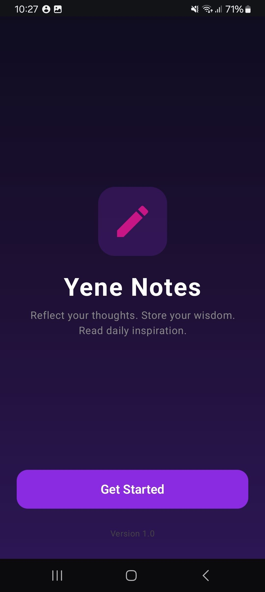
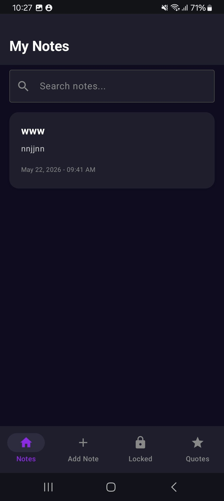
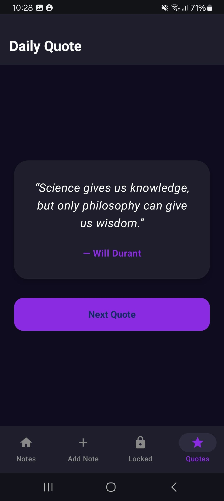

# MobileLabExam

yene notes  is a Jetpack Compose Android note app with local Room storage, locked/private notes, a search experience, and a daily quote screen powered by Retrofit.

## Features

- Create, edit, and delete notes.
- Mark notes as locked/private.
- View unlocked and locked notes in separate screens.
- Search notes by title or content.
- Load and display a random daily quote from the network.
- Protect access to locked notes using the device screen lock.

## Tech Stack

- Kotlin
- Jetpack Compose
- Room
- Retrofit
- Coroutines and Flow
- AndroidX Lifecycle ViewModel

## App Flow

1. The app opens on a splash screen.
2. The main navigation shows notes, locked notes, add note, and quote screens.
3. Notes are stored locally with Room.
4. Locked notes require device credential verification before viewing.
5. Quotes are loaded from the remote API and a fallback quote is shown if the request fails.

## Screenshots

Add the following images under `docs/screenshots/` and the README will render them automatically.

- `docs/screenshots/splash.png`
- `docs/screenshots/notes.png`
- `docs/screenshots/addnote.png`
- `docs/screenshots/notedetail.png`
- `docs/screenshots/locked.png`
- `docs/screenshots/quote.png`

### Preview

| Screen | Screenshot |
| --- | --- |
| Splash |  |
| Notes |  |
| Add Note |  |
| Note Detail |  |
| Locked Notes |  |
| Quote |  |

## Project Structure

- `app/src/main/java/com/example/mobilelabexam/MainActivity.kt`
- `app/src/main/java/com/example/mobilelabexam/ui/screens/`
- `app/src/main/java/com/example/mobilelabexam/data/`
- `app/src/main/java/com/example/mobilelabexam/viewmodel/`

## Notes

- The app uses `android.permission.INTERNET` for the quote API.
- Locked notes rely on Android's built-in device credential screen.
- The quote API includes a fallback quote list so the app still works if the network request fails.
